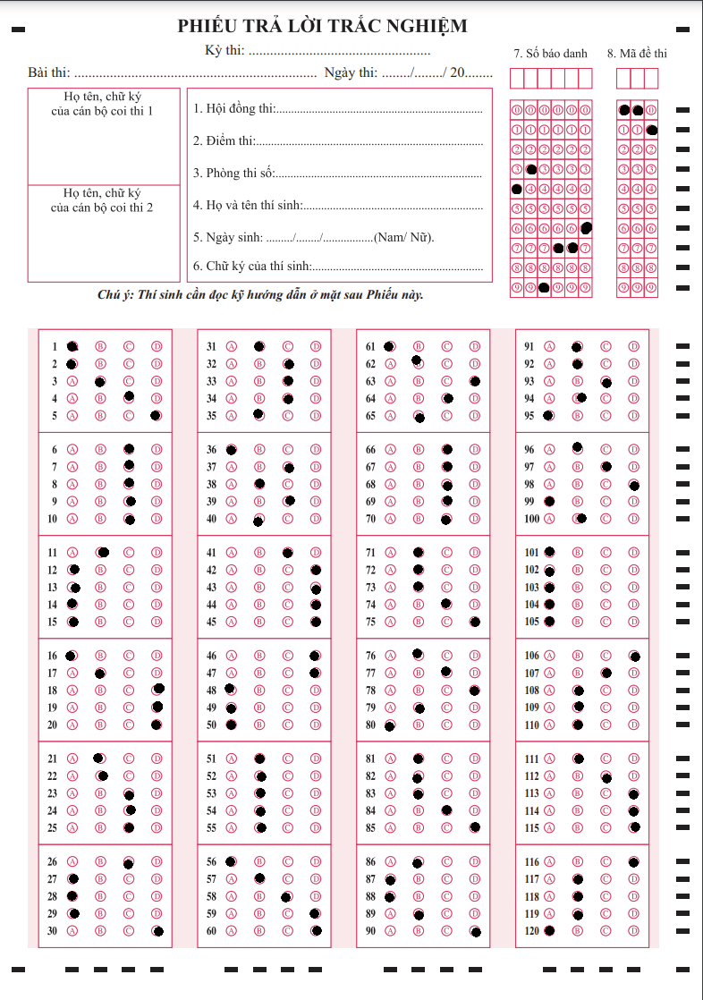
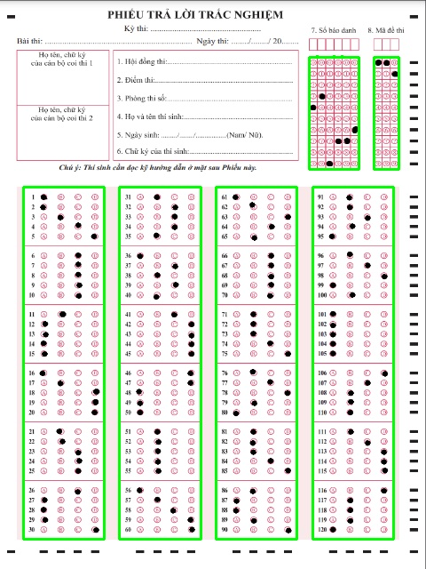
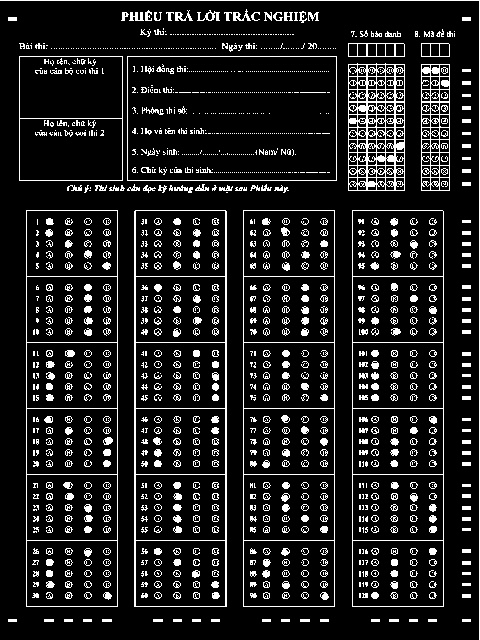
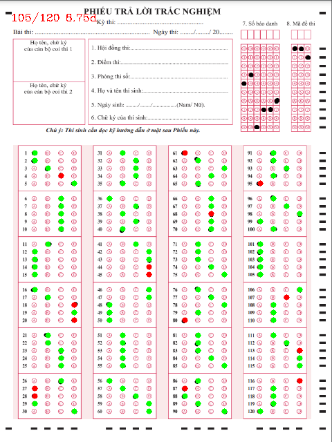
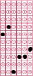
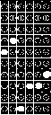
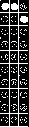

# [OpenCV] Multiple Choice Exam Scoring System

Automated Scoring System for Multiple Choice Tests Using OpenCV.

## Overview

In this project, we apply the OpenCV image processing library to address the problem of automated scoring for 120-question multiple-choice answer sheets in the National High School Examination without using machine learning or deep learning. Instead, we focus on utilizing traditional image processing methods and image analysis techniques to achieve the project's goals.

## Main Features
1. Read Scanned Image
2. Image Preprocessing:
    - Resize
    - Convert to Grayscale
    - Thresholding
3. Find Contours of Answer Blocks, Candidate Numbers, Exam Codes, etc.
4. Process and Filter Marked Boxes Recognition
5. Match and Compare Results
6. Visualization
7. Save Results

## Build Model
### Dataset
The input images in the automated scoring process are scanned images of actual high school multiple-choice answer sheets. These images typically contain information about the questions and the answer bubbles filled in by the students. The images may be either color or grayscale, depending on the scanner settings.

<p align="center">
  <br/>
  <i>Input images have a size of 640x480</i>
</p>

### Image Preprocessing
1. Resize: Although the input images are scanned and have a fixed size, in this model, we will resize the images to 640x480 for convenience in subsequent processing steps
2. Convert to Grayscale
3. Thresholding

### Identify Areas to Process
After finding the contours in the image, the next step is to identify the answer blocks, candidate number, and exam code blocks. Thus, we need to identify 6 boxes present in the image

<p align="center">
  <br/>
  <i>Boxes to be processed</i>
</p>

### Process Answer Blocks
In this exam template, we have 120 questions divided into 4 columns. Each column contains 6 boxes, each box contains 5 questions. For each question, there are 4 answer choices: 'A', 'B', 'C', 'D'. After understanding the general input structure, I divide the solution into the following steps:

- Process the input image to separate the 4 answer columns
- Divide each answer column into 6 boxes, and each box further into 5 questions
- Identify the chosen answer for each question: 
    - Use pixel-level processing techniques on the objects to determine the marked answer box for each question

<p align="center">
  <br/>
  <i>Answer blocks after thresholding</i>
</p>

### Match and Visualize
After obtaining the list of answers chosen by the candidates, we proceed to match the answers to determine the score. We also perform visualization on the screen, where correctly marked answer boxes are highlighted in green and incorrectly marked ones in red, including any invalid boxes as follows.

<p align="center">
  <br/>
  <i>Visualize the answers</i>
</p>

### Process Candidate Number and Exam Code Blocks
Similarly to the processing of the answer blocks, we proceed with a similar approach to extract the candidate number and exam code. However, in this step, we will not crop out excess areas as before. Instead, we only need to divide the blocks by height and width to extract the information and store it in a matrix to achieve the desired results.

<p align="center">
  
  
  
  
</p>
<p align="center">
  <i>Image processing on candidate number and exam code blocks</i>
</p>

### Save Results
In this final step, we save the results to a text file, including the candidate number, exam code, score, and the matching results for each question.

```result.txt```
## Requirements
- Python 3.x
- OpenCV
- Numpy

```bash
pip install -r requirements.txt
```
## How to use my code
- Clone this repository:
```bash
https://github.com/Khavanw/Multiple-Choice-Exam-Scoring-System.git
```
- Prepare the answer sheet images and answer key file
- Run the main script:
```bash
python src/main.py
```
Modify the answers if needed in the `main.py` file.
